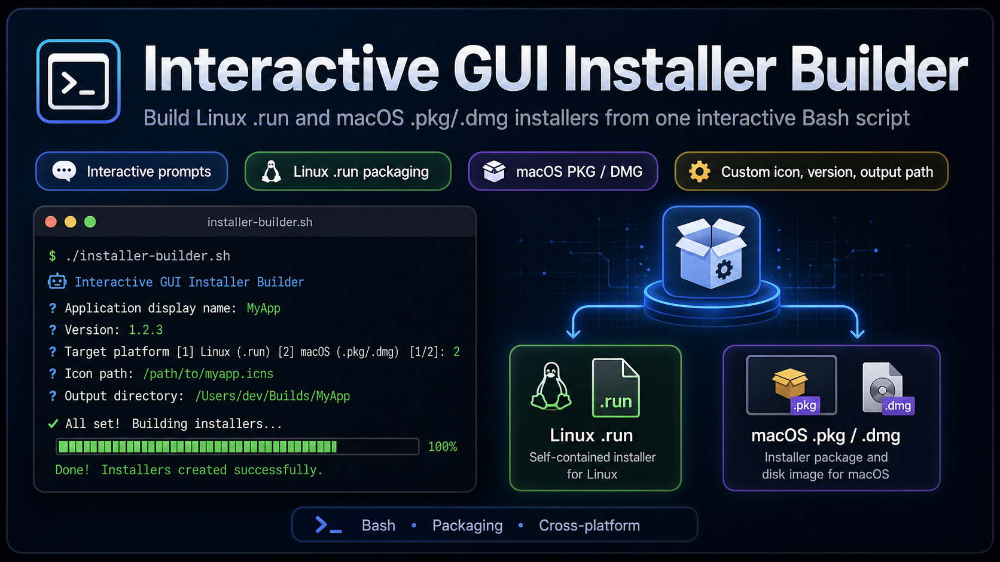

# Interactive GUI Installer Builder



**Interactive GUI Installer Builder** is a Bash-based packaging helper that creates desktop-friendly installers for Linux and macOS from an existing published application build.

It asks for the required packaging information interactively, such as the app name, version, target platform, build folder, app icon, install path, output directory, desktop metadata, and macOS package settings. This makes it easier to reuse the same script for different apps without hard-coding project-specific values.

## Features

- Interactive prompts for all important installer settings
- Linux self-extracting `.run` installer generation
- Linux `.desktop` launcher creation
- App icon support for Linux and macOS
- Custom app name, slug, version, binary name, and output directory
- Linux install path and terminal command customization
- Linux application menu entry with categories and keywords
- Built-in Linux uninstaller script
- macOS `.app` bundle generation
- macOS `.pkg` installer generation
- macOS `.dmg` disk image generation
- Optional macOS signing identity input
- Automatic host platform detection

## Supported Output Formats

| Platform | Output | Notes |
|---|---|---|
| Linux | `.run` | Self-extracting installer for Linux desktop apps |
| Linux | `.desktop` | Optional launcher for running the installer from the desktop |
| macOS | `.app` | Application bundle created from the published app files |
| macOS | `.pkg` | Installer package with macOS installer flow |
| macOS | `.dmg` | Drag-and-drop disk image for distribution |

## Requirements

### General

- Bash
- A published application build folder
- Main executable/binary inside the build folder
- Optional app icon/image file

### Linux

To build and run the Linux installer, you need:

- Linux host system
- `tar`
- `chmod`, `cp`, `mkdir`, `ln`, and other standard Unix utilities
- `pkexec` if you want to use the generated `.desktop` installer launcher

### macOS

To build macOS packages, you must run the script on macOS because the required packaging tools are native macOS tools:

- `pkgbuild`
- `productbuild`
- `hdiutil`
- `sips`
- `iconutil`

## Project Structure Example

```text
your-project/
├── interactive_gui_installer_builder.sh
├── Build/
│   └── Release/
│       └── 1.0.0/
│           ├── linux-x64/
│           │   └── YourApp
│           └── macos-x64/
│               └── YourApp
├── assets/
│   └── app-icon.png
└── Installers/
```

The exact folder names can be changed during the interactive setup. The script asks for the build folder and output directory before creating the installers.

## Installation

Clone the repository and make the script executable:

```bash
git clone https://github.com/YOUR_USERNAME/YOUR_REPOSITORY.git
cd YOUR_REPOSITORY
sed -i 's/\r$//' interactive_gui_installer_builder.sh
chmod +x interactive_gui_installer_builder.sh
```

## Usage

Run the script interactively:

```bash
./interactive_gui_installer_builder.sh
```

You can also pass the target platform as the first argument:

```bash
./interactive_gui_installer_builder.sh linux
./interactive_gui_installer_builder.sh macos
./interactive_gui_installer_builder.sh both
```

The script supports these target values:

| Target | Description |
|---|---|
| `auto` | Detects the host platform and builds the matching installer |
| `linux` | Builds the Linux `.run` installer |
| `macos` | Builds macOS `.pkg` and `.dmg` installers |
| `both` | Builds both targets when possible |

> macOS installers can only be created on macOS. If `both` is selected on Linux, the script continues with the Linux build only.

## Interactive Configuration

During execution, the script asks for values such as:

```text
Application display name
Application slug / file prefix
Main binary/executable name inside publish folder
Version
Target platform
Where generated setup files should be saved
Icon/image path
App comment/description
Generic name
Website
Linux publish/build folder
Linux install path
Linux terminal command / symlink name
Linux desktop categories
Linux desktop keywords
macOS publish/build folder
macOS .app bundle name
macOS bundle/package identifier
macOS DMG size
macOS Developer ID signing identity
```

This keeps the builder reusable across multiple projects and versions.

## Linux Build Example

Example values:

```text
Application display name: MyApp
Application slug / file prefix: myapp
Main binary/executable name: MyApp
Version: 1.0.0
Target platform: linux
Output directory: Installers
Icon/image path: assets/app-icon.png
Linux publish/build folder: Build/Release/1.0.0/linux-x64
Linux install path: /opt/myapp
Linux terminal command: myapp
```

Generated files:

```text
Installers/myapp-1.0.0-Linux-GUI.run
Installers/myapp-installer.desktop
```

Install on Linux:

```bash
cd Installers
sudo bash myapp-1.0.0-Linux-GUI.run
```

After installation, the app can be launched from:

```bash
myapp
```

Or from the desktop application menu.

Uninstall:

```bash
sudo bash /opt/myapp/uninstall.sh
```

## macOS Build Example

Example values:

```text
Application display name: MyApp
Application slug / file prefix: myapp
Main binary/executable name: MyApp
Version: 1.0.0
Target platform: macos
Output directory: Installers
Icon/image path: assets/app-icon.icns
macOS publish/build folder: Build/Release/1.0.0/macos-x64
macOS .app bundle name: myapp.app
macOS bundle/package identifier: com.example.myapp
macOS DMG size: 500m
```

Generated files:

```text
Installers/myapp-1.0.0-macOS-GUI.pkg
Installers/myapp-1.0.0-macOS.dmg
```

## Notes About Icons

For Linux, a `.png` icon is recommended.

For macOS, an `.icns` icon is recommended. If a `.png` file is provided on macOS, the script can convert it into an `.icns` file using native macOS tools.

## Code Signing on macOS

For public macOS distribution, signing and notarization are recommended.

The script supports an optional signing identity input. If you skip signing, the generated package can still be created, but macOS Gatekeeper may show security warnings when users try to open the app.

Example signing identity format:

```text
Developer ID Application: Your Name (TEAMID)
```

## Troubleshooting

### Build folder not found

Make sure the app is published before running the packaging script.

Example:

```bash
dotnet publish -c Release -r linux-x64 --self-contained
dotnet publish -c Release -r osx-x64 --self-contained
```

Then provide the correct publish folder path when the script asks for it.

### Binary not found

Check that the binary name entered during setup exactly matches the executable file inside the publish folder.

### macOS package tools not found

Run the macOS target on a macOS machine with Xcode Command Line Tools installed.

### Linux installer needs root permission

The generated Linux installer writes to system folders such as `/opt`, `/usr/local/bin`, and `/usr/share/applications`, so it must be run with root permissions:

```bash
sudo bash your-app-version-Linux-GUI.run
```

## Repository Files

Recommended files for this repository:

```text
.
├── README.md
├── interactive_gui_installer_builder.sh
└── assets/
    └── interactive-installer-builder.png
```

## License

Choose a license that fits your project. Common options include MIT, Apache-2.0, and GPL-3.0.

If you use MIT, add a `LICENSE` file and update this section:

```text
MIT License
Copyright (c) YEAR YOUR_NAME
```

## Contributing

Contributions are welcome. You can improve the project by opening issues, suggesting new packaging targets, improving platform support, or submitting pull requests.

## Author

Created for building reusable Linux and macOS GUI installers from a single interactive Bash script.
